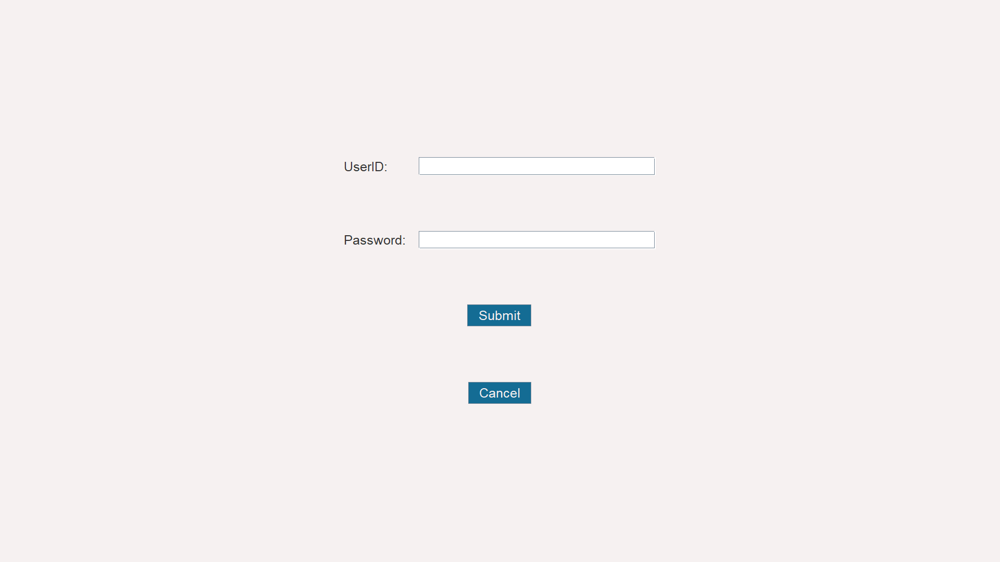
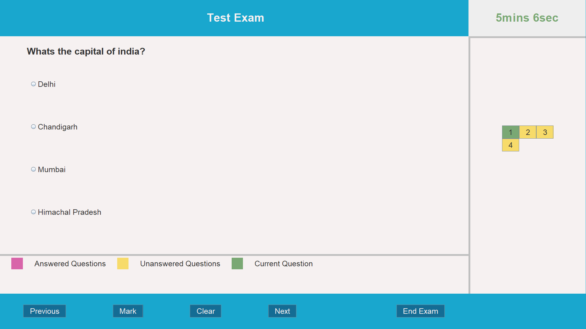
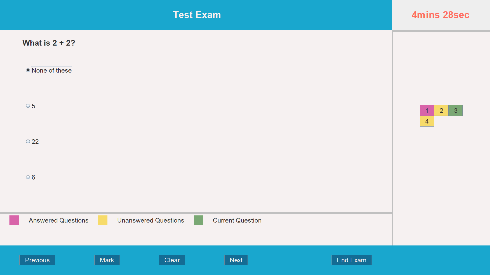
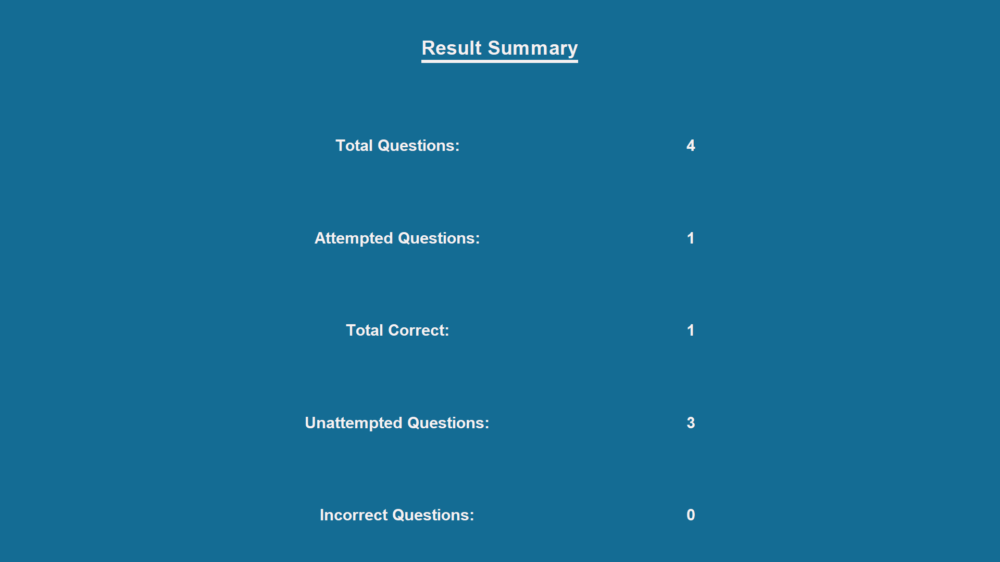

# Online Exam System :pen:
---
An online exam system made in java using swing and mysql with custom protocol over TCP/IP

## Configuring
`Server/Database/db.config` file is where all the mysql server configuration is stored in format
```conf
db.server=jdbc:mysql://{url}/{database_name}?user={username}
db.name={username}
db.password={password}
```


## Compiling
```shell
make compile
```

## Initialize Database
```shell
$ make run filename=Server.Database.InitializeDB
```

## Running Server
```shell
$ make run filename=Server.Server
```

## Running Client Application
```shell
$ make run filename=Client.Application
```

## Screenshots
| | |
-- | --
|  |  |
|  |  |
